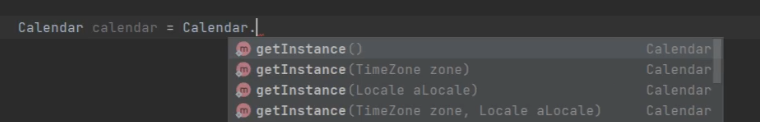

# The concepts when choosing a factory are that:

it doesn't expose instantiation logic.
It's used to create objects without specifying their exact classes.

The client knows next to nothing about even the type of object that is being created.

Examples of this in the Java API are:

* Calendar
* ResourceBundles
* NumberFormat

Oftentimes people think that Calendar is a singleton because it has no arguments or a no arguments' constructor,
and factory methods can have arguments.

The difference is that a calendar can return different subclasses of the calendar and the client are unaware,
whereas with a singleton you are just getting a single instance of that implementing class

.